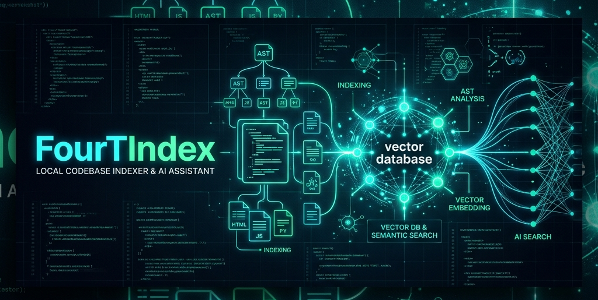
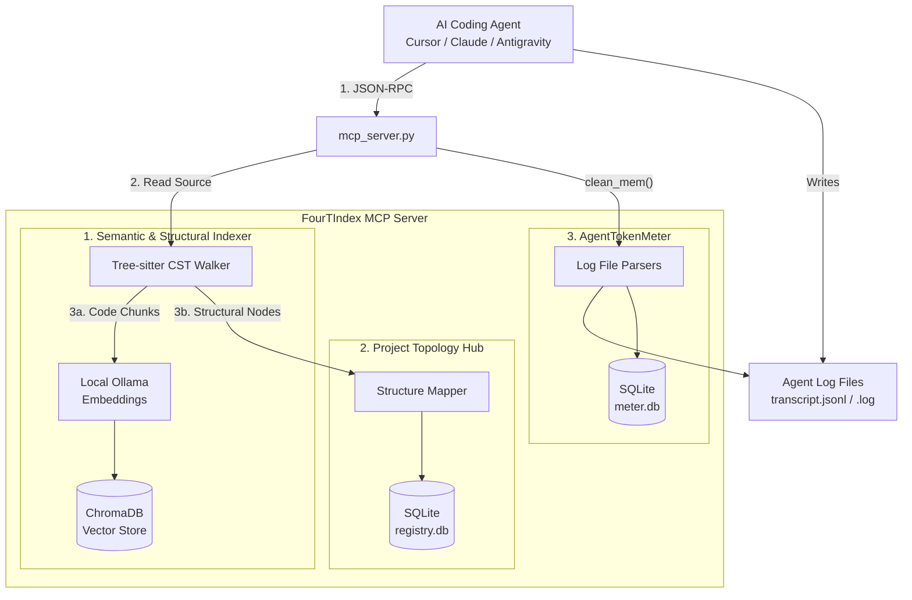

<p align="center">
  
</p>

<h1 align="center">FourTIndex 🚀</h1>

<p align="center">
  <strong>High-fidelity local codebase semantic indexer and Model Context Protocol (MCP) server for local-first AI development. Now equipped with Omni-Language Tree-sitter parsing & automatic project roadmaps.</strong>
</p>

<p align="center">
  <a href="https://opensource.org/licenses/MIT"></a>
  <a href="https://www.python.org/"></a>
  <a href="https://ollama.com/"></a>
  <a href="https://lmstudio.ai/"></a>
  <a href="https://www.trychroma.com/"></a>
  <a href="https://modelcontextprotocol.io/"></a>
</p>

---

## 📌 Table of Contents

- [💡 Overview](#-overview)
- [📐 Architecture & Data Flow](#-architecture--data-flow)
- [✨ Key Features](#-key-features)
- [🌲 Omni-Language Tree-sitter Parser](#-omni-language-tree-sitter-parser)
- [🗺️ Automatic Project Structure Mapping](#-automatic-project-structure-mapping)
- [⚡ Quick Start (For Developers)](#-quick-start-for-developers)
- [💾 VRAM cleaner & Built-in Token Counter](#-vram-cleaner--built-in-token-counter)
- [📊 Performance & Cost Benchmark](#-performance--cost-benchmark-multi-language)
- [🛠️ CLI Command Cheatsheet](#-cli-command-cheatsheet)
- [🧩 MCP Client Integration](#-mcp-client-integration)
- [📖 MCP Tool Specifications](#-mcp-tool-specifications)
- [🤖 Agent Customization & System Rules](#-agent-customization-rules)
- [💖 Support the Project](#-support-the-project)

---

## 💡 Overview

**FourTIndex** is designed for software developers who pair-program with AI agents (like Cursor, Claude Desktop, Copilot, or Antigravity) and want to keep their codebase index 100% local, secure, and lightning-fast.

By running a local vector database (ChromaDB) and local LLMs (Ollama), `FourTIndex` parses your codebase (using tree-sitter AST nodes for structural parsing and semantic markdown chunking for skills), indexes it, and exposes it via Model Context Protocol. AI agents can semantically search your codebase, query high-level outlines, and read selected files incrementally—saving token quota and preventing huge context windows from slowing down reasoning.

---

## 📐 Architecture & Data Flow



---

## ✨ Key Features

- **📦 Localized Databases:** Vector databases are now isolated locally within each project (`.fourtindex/db`) for perfect separation, while project metadata remains mapped in a global registry.
- **✨ Zero-Config AI Skill Auto-Injection:** Automatically injects the FourTIndex `SKILL.md` guidelines into `.agents/skills/FourTIndex/` whenever you start the MCP server, instantly teaching your AI agents how to use the local context tools.
- **⚡ Project-wide Batch Embeddings:** Packs chunks from multiple files into provider-aware batches.
- **🔄 Resumable Incremental Sync:** Checkpoints successful files and only re-indexes changed content.
- **🧠 LM Studio & Ollama Unified Routing:** Dynamically choose between Ollama and LM Studio for embeddings and LLM completions.
- **🎯 Local & API Reranking:** Perform relevance ranking locally (or via LM Studio active models in <50ms) to deliver highly accurate context while saving token usage.
- **🌲 Omni-Language AST Walking:** Standardized tree-sitter walker that extracts classes, methods, functions, and scoping across multiple target languages.
- **🗺️ Automatic Project Roadmaps:** Traverses directory structures, prunes ignored folders, detects project framework signatures, and stores roadmaps inside a central SQLite registry database.
- **📝 Heading-Aware Markdown Splitting:** Dedicated parser for customization `SKILL.md` folders that extracts YAML frontmatter and splits instructions by H2/H3 headers.
- **🛡️ Self-Healing Relative Paths:** Automatically resolves relative file path requests by scanning all registered projects in the global registry database.
- **🍃 VRAM/RAM GPU Cleaner & Token Counter:** Unloads heavy models from local GPU memory and prints a token usage & cost summary automatically when done.

---

## 🌲 Omni-Language Tree-sitter Parser

FourTIndex leverages **Tree-sitter** for structural code analysis. Instead of relying on rigid, language-specific regex or queries, our CST walker evaluates concrete syntax tree structures dynamically:

- **Standard Web/Fullstack**: `.py` (Python), `.js` (JavaScript), `.ts` (TypeScript), `.jsx` (React JS), `.tsx` (React TS), `.rs` (Rust), `.go` (Go), `.java` (Java), `.kt` (Kotlin), `.swift` (Swift).
- **Game Engines**: `.cs` (C# for Unity/Godot), `.cpp`/`.h` (C++ for Unreal/Cocos), `.gd` (GDScript for Godot), `.lua` (Lua for Roblox).

> [!NOTE]
> **Robust Error Recovery**: When parsing files mid-edit, the walker isolates syntax error nodes (`ERROR`) locally, continuing to traverse other subtrees safely.
> **Graceful Fallbacks**: If a language grammar is missing or fails to load, FourTIndex automatically falls back to a sliding-window line-based chunker, ensuring indexing never crashes.

---

## 🗺️ Automatic Project Structure Mapping

During codebase indexing, the directory traversal loop captures a complete structural roadmap:

1. **Directory Tree Topology**: Builds a clean nested JSON model representing folders and files (explicitly respecting `.gitignore` and `exclude_dirs`).
2. **Framework Signature Detection**: Scans for signature architectural anchor files to identify project frameworks:
   - `.csproj` $\rightarrow$ Unity / C#
   - `.uproject` $\rightarrow$ Unreal Engine
   - `project.godot` $\rightarrow$ Godot Engine
   - `package.json` (with Cocos deps) $\rightarrow$ Cocos Creator
   - `default.project.json`/`main.lua` $\rightarrow$ Roblox
3. **SQLite Caching Table**: Commits the JSON roadmap, framework profile, and last-updated timestamp to the centralized `project_roadmaps` table in `~/.fourtindex/registry.db`.

---

## ⚡ Quick Start (For Developers)

### 1. Initialize Python Environment

```bash
# Clone the repository
git clone https://github.com/Chunn241529/FourTIndex.git
cd FourTIndex

# Create and activate virtual environment
python -m venv .venv
# Windows:
.venv\Scripts\activate
# macOS/Linux:
source .venv/bin/activate

# Install package in editable mode
pip install -e .
```

### 2. Auto-setup Ollama or LM Studio & Models

Make sure your local provider service is running, then pull/configure the required models:

* **For Ollama:**
  ```bash
  fourtindex setup-ollama
  ```
* **For LM Studio:**
  Ensure the required models (e.g. `qwen3-reranker-0.6b` and `text-embedding-qwen3-embedding-0.6b`) are loaded or added, then run:
  ```bash
  fourtindex setup-lmstudio
  ```

### 3. Verify Providers

Verify the local embedding status:

```bash
fourtindex providers --check
```

### 4. Index Project Codebase

```bash
# Index the current directory
fourtindex index .
```

> [!WARNING]
> **First-Time Indexing Duration**: The initial indexing of a project generates embeddings for all code chunks and may take some time depending on your codebase size and local Ollama GPU/CPU hardware performance. Subsequent runs are incremental and complete in less than a second as only modified files are processed.

---

## 💾 VRAM cleaner & Built-in Token Counter

### 1. VRAM Memory Cleaner

To free up GPU memory instantly after running a large indexing job or vector search session, run:

- **CLI command**: `fourtindex clean-mem`
- **Agent tool**: Ask your AI coding agent to invoke the `clean_mem()` MCP tool.

### 2. Built-in Agent Token Counter (AgentTokenMeter)

FourTIndex monitors coding-agent token usage completely offline. Whenever it evaluates session logs (via `clean_mem`, dashboard requests, or MCP queries), adapter-based discovery compares Codex, Claude Code, and Antigravity logs, selects the active session, and prints/saves its token report.

- **Dedicated MCP Tool**: Ask your AI coding agent to call **`get_token_report()`** at any time during a session to fetch the pricing report.
- **Persistent Files**: The report is saved automatically:
  - **Globally**: `~/.fourtindex/token_report.txt`
  - **Locally**: `.fourtindex/token_report.txt` in the project root folder (if it exists).

#### Output Example:

```text
============================================================
                BÁO CÁO ĐÁNH GIÁ SỬ DỤNG TOKEN
============================================================
Agent:               ANTIGRAVITY
Model:               gemini-3.5-flash
ID Hội thoại:        d34fc9ef-1f1b-4a28-81b8-69c4d77435a7
------------------------------------------------------------
 📊 LƯỢT VỪA XONG (LATEST TURN):
  - Prompt (Input):    64 tokens
  - Completion (Out):  17,174 tokens
  - Tổng số Token:     17,238
  - Số Tool đã gọi:    9
  - Chi phí lượt này:  $0.154662 USD
------------------------------------------------------------
 📈 TỔNG CẢ PHIÊN (TOTAL SESSION):
  - Prompt (Input):    4,728 tokens
  - Completion (Out):  87,342 tokens
  - Tổng số Token:     92,070
  - Số Tool đã gọi:    68
  - Tổng chi phí:      $0.793170 USD
============================================================
```

_Note: Usage data is recorded in SQLite database `~/.agent_token_meter/meter.db`._

#### Live-Watch Terminal CLI:

Run a live-updating token counter in a separate console window:

```bash
cd scratch/agent-token-meter
python cli.py watch
```

---

## 📊 Performance & Cost Benchmark (Multi-Language)

To verify parallel indexing speedups and roadmap registration, we run a multi-language performance benchmark containing C#, TS, Lua, C++, Python, and Swift source files:

| Metric / Scenario       | ❌ Sequential Indexing <br>_(workers=1, batch-size=1)_ | ✔ Parallel & Batched Indexing <br>_(workers=4, batch-size=32)_ | 🚀 Efficiency Gain |
| :---------------------- | :----------------------------------------------------- | :------------------------------------------------------------- | :----------------- |
| **Duration (50 Files)** | **9.97 seconds**                                       | **2.94 seconds**                                               | **3.39x faster**   |
| **Frameworks Profile**  | -                                                      | Godot, Roblox (Lua)                                            | **100% Detected**  |

#### Run the Benchmark Locally:

You can run the live benchmark simulation script on your machine to verify these metrics:

```bash
python benchmarks/run_benchmark.py
```

---

## 🛠️ CLI Command Cheatsheet

| Command                    | Arguments                      | Description                                            |
| :------------------------- | :----------------------------- | :----------------------------------------------------- |
| `fourtindex index`         | `[path]`                       | Indexes or resumes indexing the target codebase.       |
| `fourtindex providers`     | `[--check]`                    | Shows the local embedding provider status.             |
| `fourtindex search`        | `"<query>"` `[--file-ext EXT]` | Performs semantic codebase search with reranking.      |
| `fourtindex query`         | `"<question>"`                 | Queries the local LLM with reranked context.           |
| `fourtindex index-skill`   | `<path_to_skill>`              | Indexes custom agent guidelines (`SKILL.md`).          |
| `fourtindex search-skills` | `"<query>"`                    | Semantically searches indexed customization skills.    |
| `fourtindex setup-ollama`  | _None_                         | Verifies Ollama connection and pulls default models.   |
| `fourtindex setup-lmstudio`| _None_                         | Verifies LM Studio connection, loads models, sets active.|
| `fourtindex clean-mem`     | _None_                         | Unloads models and prints token evaluation report.     |
| `fourtindex mcp`           | _None_                         | Launches the stdio MCP server for client integrations. |

---

## 🧩 MCP Client Integration

### Cursor Integration

Go to `Cursor Settings > Features > MCP`, add a new tool:

- **Name**: `fourtindex`
- **Type**: `stdio`
- **Command**: `/path/to/FourTIndex/.venv/Scripts/python.exe /path/to/FourTIndex/main.py mcp`

> [!IMPORTANT]
> **Windows/macOS Path Note**: Replace `/path/to/FourTIndex` with the actual absolute path to your cloned `FourTIndex` folder (e.g. `C:/Users/username/FourTIndex`). Use forward slashes `/` even on Windows to prevent string escaping issues.

### Claude Desktop Integration

Add the following to `%APPDATA%\Claude\claude_desktop_config.json` on Windows (or `~/Library/Application Support/Claude/claude_desktop_config.json` on macOS):

```json
{
  "mcpServers": {
    "fourtindex": {
      "command": "/path/to/FourTIndex/.venv/Scripts/python.exe",
      "args": ["/path/to/FourTIndex/main.py", "mcp"],
      "env": {
        "PYTHONPATH": "/path/to/FourTIndex"
      }
    }
  }
}
```

---

## 📖 MCP Tool Specifications

- **`search_codebase(query: str, project_name: str, limit: int, file_ext: str, language: str) -> str`**
  - Semantically searches the codebase. Filters by extension and language dynamically.
- **`get_file_outline(file_path: str, project_name: str) -> str`**
  - Retrieves a file's class/method signatures outline with boundary line numbers.
- **`get_symbol_definition(symbol_name: str, project_name: str) -> str`**
  - Returns the full implementation body for **Functions**, and outlines for **Classes**.
- **`read_code_lines(file_path: str, start_line: int, end_line: int, project_name: str) -> str`**
  - Reads physical lines. Resolves relative paths automatically.
- **`index_project(project_path: str, project_name: str, rebuild: bool, force: bool) -> str`**
  - Indexes or incrementally syncs a project's codebase, generating code embeddings and updating the registry directory tree structure.
- **`get_project_roadmap(project_name: str) -> str`**
  - **[New]** Retrieves the full JSON structural overview and detected frameworks.
- **`list_projects() -> str`**
  - **[New]** Lists all registered projects with roadmaps, path directories, and framework configurations.
- **`get_token_report() -> str`**
  - **[New]** Retrieves the current session's token consumption and pricing report at any time.
- **`clean_mem() -> str`**
  - Unloads models from VRAM/RAM immediately and returns token usage stats.
- **`index_skill(skill_path: str, project_name: str) -> str`**
  - Indexes custom guidelines (`SKILL.md`) by heading.
- **`search_skills(query: str, project_name: str, limit: int) -> str`**
  - Searches customization guidelines semantically.
- **`save_session_summary(session_id: str, summary_text: str, project_name: str) -> str`**
  - Saves design decisions/change history.

---

## 🤖 Agent Customization Rules

**FourTIndex features Zero-Config Skill Injection.** Whenever you run `fourtindex index` or `fourtindex mcp` in a new project, it will automatically copy the `SKILL.md` documentation into `.agents/skills/FourTIndex/SKILL.md`. This allows Antigravity agents (and other compatible systems) to automatically discover the tool's capabilities.

To enforce your AI Coding Agents to **always** use `FourTIndex` instead of standard file dumping, add the following rules.

### Global Enforcements (Recommended)
If you want to apply this rule across **all** your projects globally, append the markdown snippet below to your global agent configurations:
- **Antigravity:** `~/.gemini/config/AGENTS.md`
- **Cursor/Claude:** Add to your global system prompt or master `.cursorrules`.

### Project-Scoped Enforcements
To enforce it for a single project only, place the snippet into:
- **Antigravity:** `.agents/AGENTS.md`
- **Cursor:** `.cursorrules`

```markdown
# Local Context Retrieval Rules

This codebase is indexed locally via **FourTIndex** (an MCP server & local vector indexer). You MUST use FourTIndex tools to navigate, search, and inspect the codebase.

| Scenario / Action | Allowed Tool(s) | Strict Prohibition (DO NOT DO) | Rationale |
| :--- | :--- | :--- | :--- |
| **Directory Navigation** | `list_projects`, `get_project_roadmap` | `find`, `ls`, or recursive file lists | Prevents context bloating with directory tree dumps. |
| **Codebase Search** | `search_codebase` (use `file_ext` filter) | Dumping files or large text searches | Maintains target accuracy and avoids noise. |
| **File Outline** | `get_file_outline` | Reading the entire file | Scans structure first to target modifications. |
| **Read Implementation** | `get_symbol_definition`, `read_code_lines` | Reading the whole file | Focuses context only on the exact code area. |
| **Post-Edit Sync** | `index_project` (or CLI `fourtindex index .`) | Skipping database re-index | Keeps vector DB instantly updated (<1s). |
| **Resource Optimization** | `clean_mem` | Leaving model loaded in VRAM | Immediately frees RAM and GPU VRAM resources. |
| **Task Conclusion** | `save_session_summary` | Leaving session without summary | Logs design decisions for context bridges. |

```

---

<h2 align="center">💖 Support the Project</h2>

<p align="center">
  If <b>FourTIndex</b> has saved you API costs and helped you work faster, please consider supporting the project's development!
</p>

<p align="center">
  <a href="https://github.com/sponsors/Chunn241529" target="_blank"></a>
  &nbsp;&nbsp;
  <a href="https://paypal.me/TrungVuong24/5USD" target="_blank"></a>
</p>

<p align="center">
  <i>Click the buttons above to sponsor or donate via PayPal</i>
</p>

<br/>

<hr/>

<p align="center">
  <b>🇻🇳 Vietnamese Backers 🇻🇳</b><br/>
  Anh/chị có thể mời em một ly cà phê qua chuyển khoản ngân hàng nhanh (VietQR) dưới đây:
</p>

<div align="center">
  <table style="border: 1px solid #30363d; border-radius: 8px; border-collapse: separate; overflow: hidden; background-color: #0d1117;">
    <tr>
      <td align="center" style="padding: 20px; border: none; background-color: #161b22;">
        <b>Quét mã VietQR chuyển khoản</b><br/><br/>
        
      </td>
      <td align="left" style="padding: 25px; border: none; font-family: -apple-system, BlinkMacSystemFont, 'Segoe UI', Helvetica, Arial, sans-serif; line-height: 1.6;">
        <h4 style="margin-top: 0; color: #58a6ff;">🏦 THÔNG TIN CHUYỂN KHOẢN</h4>
        <p style="margin: 6px 0;">Ngân hàng: <b>MB Bank (Ngân hàng Quân đội)</b></p>
        <p style="margin: 6px 0;">Số tài khoản: <code style="background-color: #30363d; padding: 2px 6px; border-radius: 4px; color: #ff7b72;">0358570211</code></p>
        <p style="margin: 6px 0;">Tên tài khoản: <b>VUONG NGUYEN TRUNG</b></p>
        <p style="margin: 6px 0;">Nội dung chuyển khoản: <code style="background-color: #30363d; padding: 2px 6px; border-radius: 4px; color: #ff7b72;">Donate FourTIndex</code></p>
        <hr style="border: 0; border-top: 1px solid #30363d; margin: 15px 0;"/>
        <p style="margin: 6px 0; font-size: 13px; color: #8b949e;">👉 <i>Hệ thống tự động nhận diện và ghi nhận đóng góp từ cộng đồng. Cảm ơn sự đồng hành của bạn!</i></p>
      </td>
    </tr>
  </table>
</div>
