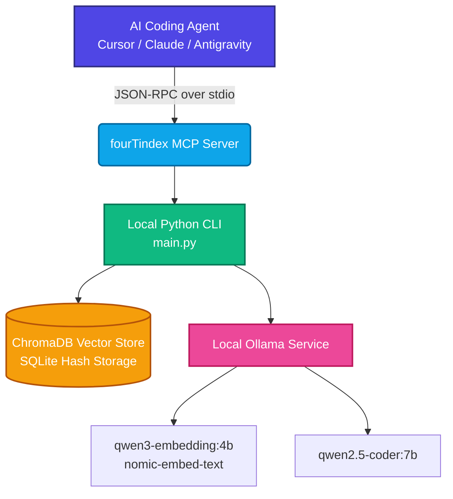

<h1 align="left">FourTIndex 🚀</h1>

<p align="center">
  <strong>High-fidelity local codebase semantic indexer and Model Context Protocol (MCP) server for local-first AI development.</strong>
</p>

<p align="center">
  <a href="https://opensource.org/licenses/MIT"></a>
  <a href="https://www.python.org/"></a>
  <a href="https://ollama.com/"></a>
  <a href="https://www.trychroma.com/"></a>
  <a href="https://modelcontextprotocol.io/"></a>
</p>

---

## 📌 Table of Contents

- [💡 Overview](#-overview)
- [📐 Architecture & Data Flow](#-architecture--data-flow)
- [✨ Key Features](#-key-features)
- [⚡ Quick Start](#-quick-start)
- [💾 VRAM & RAM Memory Optimization](#-vram--ram-memory-optimization)
- [🛠️ CLI Command cheatsheet](#%EF%B8%8F-cli-command-cheatsheet)
- [🧩 MCP Client Integration](#-mcp-client-integration)
- [📖 MCP Tool Specifications](#-mcp-tool-specifications)
- [🤖 Agent Customization & System Rules](#-agent-customization--system-rules)

---

## 💡 Overview

**FourTIndex** is designed for software developers who pair-program with AI agents (like Cursor, Claude Desktop, Copilot, or Antigravity) and want to keep their codebase index 100% local, secure, and lightning-fast. 

By running a local vector database (ChromaDB) and local LLMs (Ollama), `fourTindex` parses your codebase (using AST for Python structures and semantic markdown chunking for skills), indexes it, and exposes it via Model Context Protocol. AI agents can semantically search your codebase, query high-level outlines, and read selected files incrementally—saving token quota and preventing huge context windows from slowing down reasoning.

---

## 📐 Architecture & Data Flow



---

## ✨ Key Features

* **⚡ Project-wide Batch Embeddings:** Packs chunks from multiple files into provider-aware batches.
* **🔄 Resumable Incremental Sync:** Checkpoints successful files and only re-indexes changed content.
* **🌐 Multi-provider Embeddings:** Supports Voyage, Jina, Cloudflare, Pinecone, Gemini, Cohere, NVIDIA, and local Ollama.
* **🌳 AST-based Python Parsing:** Extracts class definitions, docstrings, method signatures, and decorators as structured logical blocks.
* **📝 Heading-Aware Markdown Splitting:** Dedicated parser for customization `SKILL.md` folders that extracts YAML frontmatter and splits instructions by H2/H3 headers.
* **🛡️ Self-Healing Relative Paths:** Automatically resolves relative file path requests by scanning all registered projects in the global registry database.
* **🍃 VRAM/RAM GPU Cleaner:** Programmatically unloads heavy models from local GPU memory between task executions to keep your computer responsive.

---

## 🔰 Quick Setup Guide

A step-by-step guide to quickly install, configure API keys, and integrate **fourTindex** with **Cursor** or **Claude Desktop**.

### 1. Install Required Core Tools
* **Step 1: Install Ollama** (Local offline AI runner)
  1. Visit the official [Ollama.com](https://ollama.com) website and download the application.
  2. Double-click the downloaded installer to install it (simply click **Install** and wait for completion).
  3. Ensure Ollama is running in the background (visible in your system tray).
* **Step 2: Install Python**
  1. Download the latest Python release from [Python.org](https://www.python.org/downloads/) or install **Python** directly from the **Microsoft Store** (Windows).
  2. **⚠️ IMPORTANT:** During the initial Python setup window, you **MUST** check the box for **"Add Python to PATH"** at the bottom before clicking the install button.

### 2. Download and Install fourTindex
1. Download this **fourTindex** repository to your machine (download the `.zip` file and extract it).
2. Navigate to the extracted repository folder.
3. **Open a terminal window at this folder:**
   * **Windows Quick Method:** Click the address bar at the top of the file explorer (which displays the folder path like `D:\project\FourTIndex`), type `cmd` and press **Enter**. A command prompt window will open.
4. **Install the package:**
   * Paste the following command and press **Enter**:
     ```bash
     pip install -e .
     ```

### 3. Configure API Keys (.env File)
If you want to use cloud embedding models for higher speed or quality (e.g., Voyage AI, Jina, Gemini...):
1. Find the `.env.example` file in the root folder of the project.
2. Create a copy of this file and rename it to `.env` (or directly rename `.env.example` to `.env`).
3. Open the `.env` file in any text editor (like Notepad, VS Code) and enter the API keys for the providers you want to use:
   ```dotenv
   VOYAGE_API_KEY=your_api_key_here
   JINA_API_KEY=your_api_key_here
   GEMINI_API_KEY=your_api_key_here
   ```
4. On the `FOURTINDEX_EMBEDDING_PROVIDER_CHAIN` line, list the providers you want to prioritize. fourTindex will check them from left to right; if one fails or runs out of quota, it will automatically fallback to the next:
   ```dotenv
   # Example: Prefer Voyage, fallback to Jina, and then fallback to offline Ollama
   FOURTINDEX_EMBEDDING_PROVIDER_CHAIN=voyage,jina,ollama
   ```
   *By default, if you don't configure any keys or edit this file, fourTindex will run offline using Ollama.*

### 4. Pull Offline Models
Go back to the command prompt from Step 2, and run the following command to automatically download the default semantic search models:
```bash
fourtindex setup-ollama
```
*(This may take 2-5 minutes depending on your internet connection).*

### 5. Integrate with Cursor
1. Open **Cursor**.
2. Press `Ctrl + ,` (or `Cmd + ,` on Mac) to open settings, or click the **gear icon** in the top right corner.
3. Select **Features** -> scroll down to the bottom and find the **MCP** section.
4. Click the **+ Add New MCP Tool** button.
5. Enter the details precisely:
   * **Name:** `fourtindex`
   * **Type:** Select `stdio`
   * **Command:** Enter:
     ```bash
     fourtindex mcp
     ```
     *(If it doesn't connect, try: `python -m fourtindex mcp`)*
6. Click **Save**. If you see a **green dot** (Active) next to `fourtindex`, the integration is successful!

You can now chat with the Cursor AI and ask: *"Please search the codebase semantically..."* or *"Get file outline..."*, and it will invoke fourTindex automatically.

---

## ⚡ Quick Start (For Developers)

Clone the repository and initialize the Python virtual environment:

```bash
# Clone the repository
git clone https://github.com/your-repo/fourTindex.git
cd fourTindex

# Create virtual environment
python -m venv .venv

# Activate virtual environment
# Windows:
.venv\Scripts\activate
# macOS/Linux:
source .venv/bin/activate

# Install package in editable mode
pip install -e .
```

### 2. Auto-setup Ollama & Pull Models

Verify your local Ollama installation and automatically pull all models configured in `config.yaml` using our visual setup tool:

```bash
fourtindex setup-ollama
```

<details>
<summary><b>Manual Installation Instructions (Fallback)</b></summary>

* **Windows**: Download the installer from [ollama.com/download/OllamaSetup.exe](https://ollama.com/download/OllamaSetup.exe) and run the wizard.
* **macOS**: Install via Homebrew: `brew install ollama` and start: `brew services start ollama`.
* **Linux**: Run `curl -fsSL https://ollama.com/install.sh | sh` and start: `sudo systemctl start ollama`.
</details>

### 3. Index Codebase

Initialize the vector database for your current project:

```bash
fourtindex index .
```

### 4. Optional Cloud Embedding Providers

Copy `.env.example` to `.env`, add only the API keys you intend to use, and explicitly opt in to a provider chain. Source code is never sent to a cloud provider merely because a key exists.

```dotenv
FOURTINDEX_EMBEDDING_PROVIDER_CHAIN=voyage,jina,cloudflare,pinecone,gemini,cohere,nvidia,ollama
```

Inspect configuration without revealing credentials:

```bash
fourtindex providers
fourtindex providers --check
```

Each project pins its provider, model, dimension, and query/document modes. Changing providers requires a full rebuild because embedding spaces are incompatible:

```bash
fourtindex index . --rebuild --embedding-provider ollama
```

Free allocations change over time. As verified on 2026-07-05, Voyage provides 200M initial tokens for supported models, Jina provides 10M tokens to new accounts, Pinecone Starter provides 5M tokens per model each month, Cloudflare provides 10,000 Neurons daily, and Gemini, Cohere, and NVIDIA provide limited free or evaluation access. Confirm current provider terms before enabling cloud processing.

---

## 💾 VRAM & RAM Memory Optimization

Large Language Models (LLM) and Embedding models loaded by Ollama reside in GPU VRAM and system RAM. By default, they remain in memory for a timeout of 5 minutes. 

To free up your GPU memory instantly after running a large indexing job or vector search session, run the memory cleaner:
* **Terminal command**: `fourtindex clean-mem`
* **Agent command**: Ask your coding agent to invoke the `clean_mem` MCP tool.

---

## 🛠️ CLI Command Cheatsheet

| Command | Arguments | Description |
| :--- | :--- | :--- |
| `fourtindex index` | `[path]` plus provider/rebuild options | Indexes or resumes the target codebase using its pinned embedding profile. |
| `fourtindex providers` | `[--check]` | Lists configured providers without exposing API keys. |
| `fourtindex search` | `"<query>"` `[--limit N]` `[--file-ext EXT]` | Performs semantic search. Filter by extension (e.g. `--file-ext .py`). |
| `fourtindex query` | `"<question>"` `[--limit N]` | Asks your local Ollama LLM a question about the codebase. |
| `fourtindex index-skill`| `<path_to_skill>` | Indexes custom agent guidelines (`SKILL.md`) using H2/H3 headers. |
| `fourtindex search-skills`| `"<query>"` `[--limit N]` | Semantically searches napped customization skills. |
| `fourtindex setup-ollama`| *None* | Verifies Ollama connection and pulls required models. |
| `fourtindex clean-mem`  | *None* | Unloads models from Ollama to free VRAM/RAM GPU memory. |
| `fourtindex mcp`        | *None* | Launches the stdio MCP server for client integrations. |

---

## 🧩 MCP Client Integration

Add `fourTindex` as a tool provider to your AI coding clients:

### Cursor Setup (`.cursorrules` or Global Settings)
Go to `Cursor Settings > Features > MCP`, add a new tool:
* **Name**: `fourtindex`
* **Type**: `stdio`
* **Command**: `d:/project/fourTindex/.venv/Scripts/fourtindex.exe mcp` *(Note: Always use forward slashes `/` for paths on Windows)*

### Claude Desktop Setup
Append the following config to your global configuration file (located at `%APPDATA%\Claude\claude_desktop_config.json` on Windows):

```json
{
  "mcpServers": {
    "fourtindex": {
      "command": "d:/project/fourTindex/.venv/Scripts/fourtindex.exe",
      "args": [
        "mcp"
      ],
      "env": {
        "PYTHONPATH": "d:/project/fourTindex"
      }
    }
  }
}
```

---

## 📖 MCP Tool Specifications

When pair-programming, your AI Agent will automatically read and invoke these tools:

* **`search_codebase(query: str, project_name: str, limit: int, file_ext: str) -> str`**
  - Searches codebase semantically. Use `file_ext` (e.g. `".py"`, `".ts"`) to filter out noise.
* **`get_file_outline(file_path: str, project_name: str) -> str`**
  - Retrieves a file's structure (classes, methods, imports) without full bodies.
* **`get_symbol_definition(symbol_name: str, project_name: str) -> str`**
  - **Crucial Behavior**:
    - If `symbol_name` is a **Function**: returns the full implementation body.
    - If `symbol_name` is a **Class**: returns the class outline (docstring, base classes, method signatures). To read class methods, query `ClassName.method_name`.
* **`read_code_lines(file_path: str, start_line: int, end_line: int, project_name: str) -> str`**
  - Reads physical lines. Automatically resolves relative paths against the project registry if launched outside the project CWD.
* **`clean_mem() -> str`**
  - Unloads models from VRAM/RAM immediately to free system resources.
* **`index_skill(skill_path: str, project_name: str) -> str`**
  - Indexes customization `SKILL.md` files by heading.
* **`search_skills(query: str, project_name: str, limit: int) -> str`**
  - Searches customization guidelines semantically.
* **`get_skill_outline(skill_name: str, project_name: str) -> str`**
  - Lists the headings table of contents of an indexed skill.
* **`read_skill_section(skill_name: str, heading: str, project_name: str) -> str`**
  - Reads the exact markdown section content under a heading of an indexed skill.
* **`save_session_summary(session_id: str, summary_text: str, project_name: str) -> str`**
  - Saves design decisions/change history.

---

## 🤖 Agent Customization & System Rules

To force your AI Coding Agents to always use `fourTindex` instead of dumping files or listing folders, place a rules file in your workspace:

* **Cursor**: Create `.cursorrules` in your project root.
* **VS Code / Copilot**: Create `.github/copilot-instructions.md` in your project root.
* **Gemini / Antigravity**: Create `.agents/AGENTS.md` in your project root.

Copy and paste these guidelines into the file:

```markdown
# Local Context Retrieval Rules

This codebase is indexed locally via **fourTindex** (an MCP server & local vector indexer). You MUST use fourTindex tools to navigate, search, and inspect the codebase.

## Directives:
1. **Do not dump directories:** Instead of listing files or reading entire folders, always use `search_codebase` to search semantically. Use the `file_ext` filter (e.g. `".py"`) to exclude noise.
2. **Read structurally first:** Call `get_file_outline` to read class/function signatures of a file before fetching its implementation.
3. **Read narrow scopes:** Use `get_symbol_definition` or `read_code_lines` to read specific code blocks. Do not read the entire file if you only need a single function.
   - *Note on get_symbol_definition: It returns the full implementation body for Functions, but only the outline for Classes. To read a specific class method, query ClassName.method_name.*
4. **Update DB after edits:** If you modify any code file, you MUST call `index_project` (or run CLI `fourtindex index .`) to update the vector database instantly (takes <1s due to 16x batch and incremental sync).
5. **Free memory when done:** Call `clean_mem()` tool (or run CLI `fourtindex clean-mem`) when you are done with heavy vector searches or indexing, to release VRAM and RAM immediately.
6. **Save design history:** Call `save_session_summary` before concluding a task to log your design decisions.
```

---

<h2 align="center">💖 Support the Project</h2>

<p align="center">
  If <b>fourTindex</b> has saved you API costs and helped you work faster, please consider supporting the project's development!
</p>

<p align="center">
  <a href="https://github.com/sponsors/Chunn241529" target="_blank">
    
  </a>
  &nbsp;&nbsp;
  <a href="https://paypal.me/TrungVuong24/5USD" target="_blank">
    
  </a>
</p>

<p align="center">
  <i>Click the buttons above to sponsor or donate via PayPal</i>
</p>

<br/>

<hr/>

<p align="center">
  <b>🇻🇳 Dành cho Lập trình viên Việt Nam (Vietnamese Backers)</b><br/>
  Bạn có thể mời tác giả một ly cà phê qua chuyển khoản ngân hàng nhanh (VietQR) dưới đây:
</p>

<div align="center">
  <table style="border: 1px solid #30363d; border-radius: 8px; border-collapse: separate; overflow: hidden; background-color: #0d1117;">
    <tr>
      <td align="center" style="padding: 20px; border: none; background-color: #161b22;">
        <b>Quét mã VietQR chuyển khoản</b><br/><br/>
        
      </td>
      <td align="left" style="padding: 25px; border: none; font-family: -apple-system, BlinkMacSystemFont, 'Segoe UI', Helvetica, Arial, sans-serif; line-height: 1.6;">
        <h4 style="margin-top: 0; color: #58a6ff;">🏦 THÔNG TIN CHUYỂN KHOẢN</h4>
        <p style="margin: 6px 0;">Ngân hàng: <b>MB Bank (Ngân hàng Quân đội)</b></p>
        <p style="margin: 6px 0;">Số tài khoản: <code style="background-color: #30363d; padding: 2px 6px; border-radius: 4px; color: #ff7b72;">0358570211</code></p>
        <p style="margin: 6px 0;">Tên tài khoản: <b>VUONG NGUYEN TRUNG</b></p>
        <p style="margin: 6px 0;">Nội dung chuyển khoản: <code style="background-color: #30363d; padding: 2px 6px; border-radius: 4px; color: #ff7b72;">Donate FourTIndex</code></p>
        <hr style="border: 0; border-top: 1px solid #30363d; margin: 15px 0;"/>
        <p style="margin: 6px 0; font-size: 13px; color: #8b949e;">👉 <i>Hệ thống tự động nhận diện và ghi nhận đóng góp từ cộng đồng. Cảm ơn sự đồng hành của bạn!</i></p>
      </td>
    </tr>
  </table>
</div>


