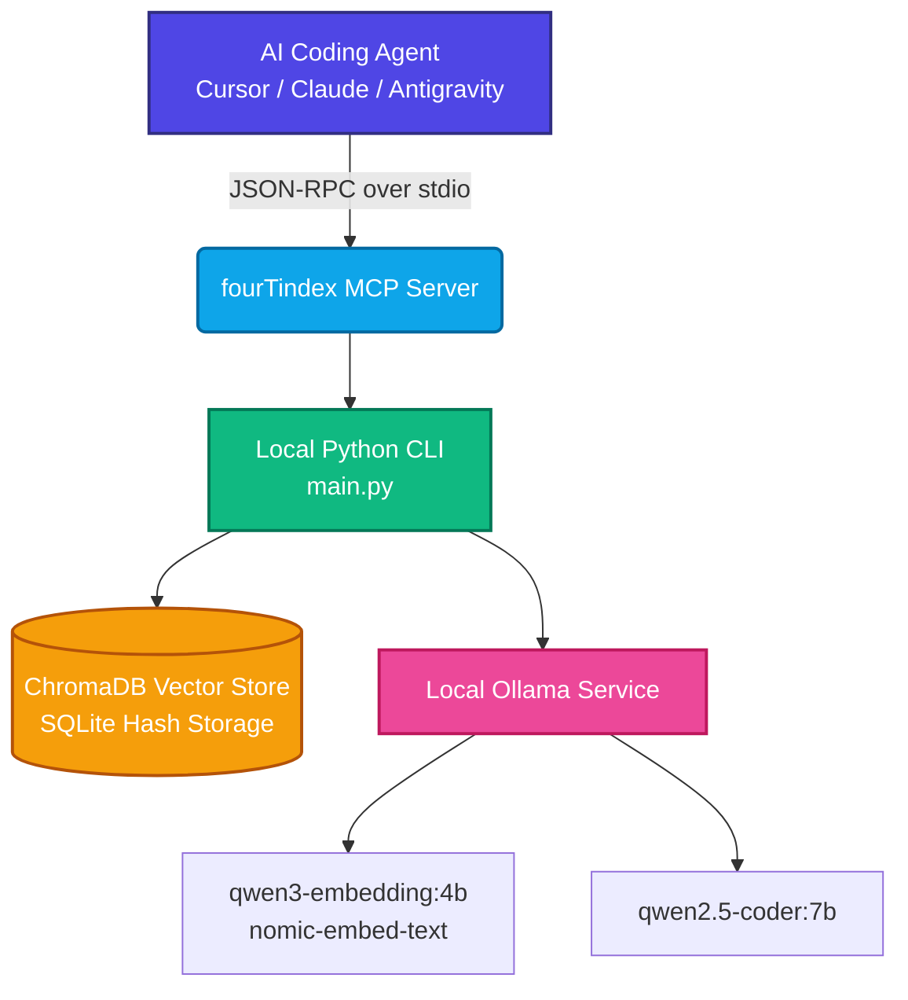

<p align="center">
  
</p>

<h1 align="center">fourTindex 🚀</h1>

<p align="center">
  <strong>High-fidelity local codebase semantic indexer and Model Context Protocol (MCP) server for local-first AI development.</strong>
</p>

<p align="center">
  <a href="https://opensource.org/licenses/MIT"></a>
  <a href="https://www.python.org/"></a>
  <a href="https://ollama.com/"></a>
  <a href="https://www.trychroma.com/"></a>
  <a href="https://modelcontextprotocol.io/"></a>
</p>

---

## 📌 Table of Contents

- [💡 Overview](#-overview)
- [📐 Architecture & Data Flow](#-architecture--data-flow)
- [✨ Key Features](#-key-features)
- [⚡ Quick Start](#-quick-start)
- [💾 VRAM & RAM Memory Optimization](#-vram--ram-memory-optimization)
- [🛠️ CLI Command cheatsheet](#%EF%B8%8F-cli-command-cheatsheet)
- [🧩 MCP Client Integration](#-mcp-client-integration)
- [📖 MCP Tool Specifications](#-mcp-tool-specifications)
- [🤖 Agent Customization & System Rules](#-agent-customization--system-rules)

---

## 💡 Overview

**fourTindex** is designed for software developers who pair-program with AI agents (like Cursor, Claude Desktop, Copilot, or Antigravity) and want to keep their codebase index 100% local, secure, and lightning-fast. 

By running a local vector database (ChromaDB) and local LLMs (Ollama), `fourTindex` parses your codebase (using AST for Python structures and semantic markdown chunking for skills), indexes it, and exposes it via Model Context Protocol. AI agents can semantically search your codebase, query high-level outlines, and read selected files incrementally—saving token quota and preventing huge context windows from slowing down reasoning.

---

## 📐 Architecture & Data Flow



---

## ✨ Key Features

* **⚡ Project-wide Batch Embeddings:** Packs chunks from multiple files into provider-aware batches.
* **🔄 Resumable Incremental Sync:** Checkpoints successful files and only re-indexes changed content.
* **🌐 Multi-provider Embeddings:** Supports Voyage, Jina, Cloudflare, Pinecone, Gemini, Cohere, NVIDIA, and local Ollama.
* **🌳 AST-based Python Parsing:** Extracts class definitions, docstrings, method signatures, and decorators as structured logical blocks.
* **📝 Heading-Aware Markdown Splitting:** Dedicated parser for customization `SKILL.md` folders that extracts YAML frontmatter and splits instructions by H2/H3 headers.
* **🛡️ Self-Healing Relative Paths:** Automatically resolves relative file path requests by scanning all registered projects in the global registry database.
* **🍃 VRAM/RAM GPU Cleaner:** Programmatically unloads heavy models from local GPU memory between task executions to keep your computer responsive.

---

## 🔰 Hướng dẫn thiết lập nhanh (Quick Setup Guide)

Hướng dẫn từng bước giúp bạn nhanh chóng cài đặt, cấu hình API Keys và tích hợp **fourTindex** vào **Cursor** hoặc **Claude Desktop**.

### 1. Cài đặt các công cụ nền tảng
* **Bước 1: Tải & Cài đặt Ollama** (Trình chạy mô hình AI offline)
  1. Truy cập trang chủ [Ollama.com](https://ollama.com) và tải ứng dụng về máy.
  2. Nhấp đúp vào file vừa tải để cài đặt (chỉ cần bấm **Install** rồi đợi chạy xong).
  3. Để Ollama tự chạy ngầm dưới khay hệ thống (nút kế bên đồng hồ).
* **Bước 2: Cài đặt Python**
  1. Tải Python bản mới nhất tại [Python.org](https://www.python.org/downloads/) hoặc cài ứng dụng **Python** trên **Microsoft Store** (Windows).
  2. **⚠️ LƯU Ý QUAN TRỌNG:** Trong màn hình cài đặt đầu tiên của Python, bạn **BẮT BUỘC** phải tích chọn vào ô **"Add Python to PATH"** ở phía dưới cùng trước khi bấm nút cài đặt.

### 2. Tải và Cài đặt fourTindex
1. Tải thư mục mã nguồn **fourTindex** này về máy tính của bạn (tải file `.zip` rồi giải nén ra).
2. Vào thư mục chứa mã nguồn vừa giải nén.
3. **Mở cửa sổ dòng lệnh tại thư mục này:**
   * **Cách nhanh nhất:** Nhấp chuột vào thanh địa chỉ ở phía trên cùng của cửa sổ thư mục (nơi hiển thị đường dẫn như `D:\project\FourTIndex`), gõ chữ `cmd` rồi bấm phím **Enter**. Một cửa sổ Command Prompt màu đen sẽ xuất hiện.
4. **Cài đặt thư viện:**
   * Dán lệnh sau vào cửa sổ đen đó và bấm **Enter**:
     ```bash
     pip install -e .
     ```

### 3. Cấu hình API Key (File .env)
Nếu bạn muốn sử dụng các mô hình nhúng đám mây (Cloud Embeddings) để tăng tốc độ và chất lượng (ví dụ: Voyage AI, Jina, Gemini...):
1. Tìm file `.env.example` trong thư mục dự án.
2. Tạo một bản sao của file này và đổi tên thành `.env` (hoặc đổi tên trực tiếp file `.env.example` thành `.env`).
3. Mở file `.env` bằng Text Editor bất kỳ (như Notepad, VS Code) và điền API Key của nhà cung cấp bạn muốn dùng:
   ```dotenv
   VOYAGE_API_KEY=your_api_key_here
   JINA_API_KEY=your_api_key_here
   GEMINI_API_KEY=your_api_key_here
   ```
4. Tại dòng `FOURTINDEX_EMBEDDING_PROVIDER_CHAIN`, liệt kê các provider bạn muốn ưu tiên sử dụng. fourTindex sẽ tự động chạy theo thứ tự từ trái qua phải, nếu bên nào lỗi hoặc hết quota sẽ tự động chuyển sang bên kế tiếp:
   ```dotenv
   # Ví dụ: ưu tiên Voyage, sau đó đến Jina, nếu lỗi hết thì dùng Ollama chạy offline cục bộ
   FOURTINDEX_EMBEDDING_PROVIDER_CHAIN=voyage,jina,ollama
   ```
   *Mặc định nếu bạn không chỉnh sửa gì hoặc không cấu hình API Key, fourTindex sẽ chỉ chạy offline thông qua Ollama.*

### 4. Thiết lập mô hình offline & Tải model
Quay lại cửa sổ dòng lệnh ở Bước 2, gõ lệnh sau để tự động tải các model AI tìm kiếm về máy:
```bash
fourtindex setup-ollama
```
*(Quá trình tải có thể mất từ 2-5 phút tùy tốc độ mạng của bạn).*

### 5. Tích hợp vào Cursor
1. Mở phần mềm **Cursor** lên.
2. Nhấn phím `Ctrl + ,` (hoặc `Cmd + ,` trên Mac) để mở phần cài đặt, hoặc nhấp vào **icon bánh răng** ở góc trên bên phải màn hình.
3. Chọn mục **Features** (Tính năng) -> Kéo xuống dưới cùng tìm phần **MCP**.
4. Bấm vào nút **+ Add New MCP Tool**.
5. Điền thông tin chính xác như sau:
   * **Name:** `fourtindex`
   * **Type:** Chọn `stdio`
   * **Command:** Nhập:
     ```bash
     fourtindex mcp
     ```
     *(Nếu không được, điền lệnh dài hơn: `python -m fourtindex mcp`)*
6. Nhấn **Save**. Nếu thấy hiển thị dấu chấm **màu xanh lá cây** (Active) bên cạnh tên `fourtindex` là bạn đã cài đặt thành công!

Bây giờ bạn có thể chat với AI trong Cursor và yêu cầu: *"Hãy tìm kiếm ngữ nghĩa trong codebase..."* hoặc *"Đọc cấu trúc file..."*, AI sẽ tự động kích hoạt bốnTindex để thực hiện.

---

## ⚡ Quick Start (For Developers)

Clone the repository and initialize the Python virtual environment:

```bash
# Clone the repository
git clone https://github.com/your-repo/fourTindex.git
cd fourTindex

# Create virtual environment
python -m venv .venv

# Activate virtual environment
# Windows:
.venv\Scripts\activate
# macOS/Linux:
source .venv/bin/activate

# Install package in editable mode
pip install -e .
```

### 2. Auto-setup Ollama & Pull Models

Verify your local Ollama installation and automatically pull all models configured in `config.yaml` using our visual setup tool:

```bash
fourtindex setup-ollama
```

<details>
<summary><b>Manual Installation Instructions (Fallback)</b></summary>

* **Windows**: Download the installer from [ollama.com/download/OllamaSetup.exe](https://ollama.com/download/OllamaSetup.exe) and run the wizard.
* **macOS**: Install via Homebrew: `brew install ollama` and start: `brew services start ollama`.
* **Linux**: Run `curl -fsSL https://ollama.com/install.sh | sh` and start: `sudo systemctl start ollama`.
</details>

### 3. Index Codebase

Initialize the vector database for your current project:

```bash
fourtindex index .
```

### 4. Optional Cloud Embedding Providers

Copy `.env.example` to `.env`, add only the API keys you intend to use, and explicitly opt in to a provider chain. Source code is never sent to a cloud provider merely because a key exists.

```dotenv
FOURTINDEX_EMBEDDING_PROVIDER_CHAIN=voyage,jina,cloudflare,pinecone,gemini,cohere,nvidia,ollama
```

Inspect configuration without revealing credentials:

```bash
fourtindex providers
fourtindex providers --check
```

Each project pins its provider, model, dimension, and query/document modes. Changing providers requires a full rebuild because embedding spaces are incompatible:

```bash
fourtindex index . --rebuild --embedding-provider ollama
```

Free allocations change over time. As verified on 2026-07-05, Voyage provides 200M initial tokens for supported models, Jina provides 10M tokens to new accounts, Pinecone Starter provides 5M tokens per model each month, Cloudflare provides 10,000 Neurons daily, and Gemini, Cohere, and NVIDIA provide limited free or evaluation access. Confirm current provider terms before enabling cloud processing.

---

## 💾 VRAM & RAM Memory Optimization

Large Language Models (LLM) and Embedding models loaded by Ollama reside in GPU VRAM and system RAM. By default, they remain in memory for a timeout of 5 minutes. 

To free up your GPU memory instantly after running a large indexing job or vector search session, run the memory cleaner:
* **Terminal command**: `fourtindex clean-mem`
* **Agent command**: Ask your coding agent to invoke the `clean_mem` MCP tool.

---

## 🛠️ CLI Command Cheatsheet

| Command | Arguments | Description |
| :--- | :--- | :--- |
| `fourtindex index` | `[path]` plus provider/rebuild options | Indexes or resumes the target codebase using its pinned embedding profile. |
| `fourtindex providers` | `[--check]` | Lists configured providers without exposing API keys. |
| `fourtindex search` | `"<query>"` `[--limit N]` `[--file-ext EXT]` | Performs semantic search. Filter by extension (e.g. `--file-ext .py`). |
| `fourtindex query` | `"<question>"` `[--limit N]` | Asks your local Ollama LLM a question about the codebase. |
| `fourtindex index-skill`| `<path_to_skill>` | Indexes custom agent guidelines (`SKILL.md`) using H2/H3 headers. |
| `fourtindex search-skills`| `"<query>"` `[--limit N]` | Semantically searches napped customization skills. |
| `fourtindex setup-ollama`| *None* | Verifies Ollama connection and pulls required models. |
| `fourtindex clean-mem`  | *None* | Unloads models from Ollama to free VRAM/RAM GPU memory. |
| `fourtindex mcp`        | *None* | Launches the stdio MCP server for client integrations. |

---

## 🧩 MCP Client Integration

Add `fourTindex` as a tool provider to your AI coding clients:

### Cursor Setup (`.cursorrules` or Global Settings)
Go to `Cursor Settings > Features > MCP`, add a new tool:
* **Name**: `fourtindex`
* **Type**: `stdio`
* **Command**: `d:/project/fourTindex/.venv/Scripts/fourtindex.exe mcp` *(Note: Always use forward slashes `/` for paths on Windows)*

### Claude Desktop Setup
Append the following config to your global configuration file (located at `%APPDATA%\Claude\claude_desktop_config.json` on Windows):

```json
{
  "mcpServers": {
    "fourtindex": {
      "command": "d:/project/fourTindex/.venv/Scripts/fourtindex.exe",
      "args": [
        "mcp"
      ],
      "env": {
        "PYTHONPATH": "d:/project/fourTindex"
      }
    }
  }
}
```

---

## 📖 MCP Tool Specifications

When pair-programming, your AI Agent will automatically read and invoke these tools:

* **`search_codebase(query: str, project_name: str, limit: int, file_ext: str) -> str`**
  - Searches codebase semantically. Use `file_ext` (e.g. `".py"`, `".ts"`) to filter out noise.
* **`get_file_outline(file_path: str, project_name: str) -> str`**
  - Retrieves a file's structure (classes, methods, imports) without full bodies.
* **`get_symbol_definition(symbol_name: str, project_name: str) -> str`**
  - **Crucial Behavior**:
    - If `symbol_name` is a **Function**: returns the full implementation body.
    - If `symbol_name` is a **Class**: returns the class outline (docstring, base classes, method signatures). To read class methods, query `ClassName.method_name`.
* **`read_code_lines(file_path: str, start_line: int, end_line: int, project_name: str) -> str`**
  - Reads physical lines. Automatically resolves relative paths against the project registry if launched outside the project CWD.
* **`clean_mem() -> str`**
  - Unloads models from VRAM/RAM immediately to free system resources.
* **`index_skill(skill_path: str, project_name: str) -> str`**
  - Indexes customization `SKILL.md` files by heading.
* **`search_skills(query: str, project_name: str, limit: int) -> str`**
  - Searches customization guidelines semantically.
* **`get_skill_outline(skill_name: str, project_name: str) -> str`**
  - Lists the headings table of contents of an indexed skill.
* **`read_skill_section(skill_name: str, heading: str, project_name: str) -> str`**
  - Reads the exact markdown section content under a heading of an indexed skill.
* **`save_session_summary(session_id: str, summary_text: str, project_name: str) -> str`**
  - Saves design decisions/change history.

---

## 🤖 Agent Customization & System Rules

To force your AI Coding Agents to always use `fourTindex` instead of dumping files or listing folders, place a rules file in your workspace:

* **Cursor**: Create `.cursorrules` in your project root.
* **VS Code / Copilot**: Create `.github/copilot-instructions.md` in your project root.
* **Gemini / Antigravity**: Create `.agents/AGENTS.md` in your project root.

Copy and paste these guidelines into the file:

```markdown
# Local Context Retrieval Rules

This codebase is indexed locally via **fourTindex** (an MCP server & local vector indexer). You MUST use fourTindex tools to navigate, search, and inspect the codebase.

## Directives:
1. **Do not dump directories:** Instead of listing files or reading entire folders, always use `search_codebase` to search semantically. Use the `file_ext` filter (e.g. `".py"`) to exclude noise.
2. **Read structurally first:** Call `get_file_outline` to read class/function signatures of a file before fetching its implementation.
3. **Read narrow scopes:** Use `get_symbol_definition` or `read_code_lines` to read specific code blocks. Do not read the entire file if you only need a single function.
   - *Note on get_symbol_definition: It returns the full implementation body for Functions, but only the outline for Classes. To read a specific class method, query ClassName.method_name.*
4. **Update DB after edits:** If you modify any code file, you MUST call `index_project` (or run CLI `fourtindex index .`) to update the vector database instantly (takes <1s due to 16x batch and incremental sync).
5. **Free memory when done:** Call `clean_mem()` tool (or run CLI `fourtindex clean-mem`) when you are done with heavy vector searches or indexing, to release VRAM and RAM immediately.
6. **Save design history:** Call `save_session_summary` before concluding a task to log your design decisions.
```
