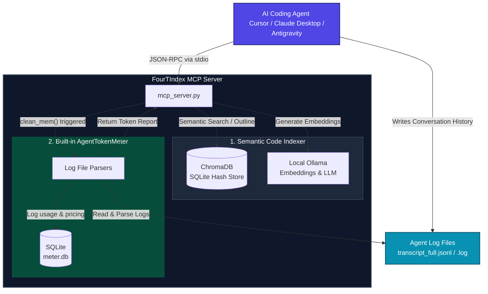

<p align="center">
  
</p>

<h1 align="center">FourTIndex 🚀</h1>

<p align="center">
  <strong>High-fidelity local codebase semantic indexer and Model Context Protocol (MCP) server for local-first AI development.</strong>
</p>

<p align="center">
  <a href="https://opensource.org/licenses/MIT"></a>
  <a href="https://www.python.org/"></a>
  <a href="https://ollama.com/"></a>
  <a href="https://www.trychroma.com/"></a>
  <a href="https://modelcontextprotocol.io/"></a>
</p>

---

## 📌 Table of Contents

- [💡 Overview](#-overview)
- [📐 Architecture & Data Flow](#-architecture--data-flow)
- [✨ Key Features](#-key-features)
- [⚡ Quick Start (For Developers)](#-quick-start-for-developers)
- [💾 VRAM cleaner & Built-in Token Counter](#-vram-cleaner--built-in-token-counter)
- [🛠️ CLI Command Cheatsheet](#-cli-command-cheatsheet)
- [🧩 MCP Client Integration](#-mcp-client-integration)
- [📖 MCP Tool Specifications](#-mcp-tool-specifications)
- [🤖 Agent Customization & System Rules](#-agent-customization-rules)
- [💖 Support the Project](#-support-the-project)

---

## 💡 Overview

**FourTIndex** is designed for software developers who pair-program with AI agents (like Cursor, Claude Desktop, Copilot, or Antigravity) and want to keep their codebase index 100% local, secure, and lightning-fast. 

By running a local vector database (ChromaDB) and local LLMs (Ollama), `FourTIndex` parses your codebase (using AST for Python structures and semantic markdown chunking for skills), indexes it, and exposes it via Model Context Protocol. AI agents can semantically search your codebase, query high-level outlines, and read selected files incrementally—saving token quota and preventing huge context windows from slowing down reasoning.

---

## 📐 Architecture & Data Flow



---

## ✨ Key Features

* **⚡ Project-wide Batch Embeddings:** Packs chunks from multiple files into provider-aware batches.
* **🔄 Resumable Incremental Sync:** Checkpoints successful files and only re-indexes changed content.
* **🌐 Multi-provider Embeddings:** Supports Voyage, Jina, Cloudflare, Pinecone, Gemini, Cohere, NVIDIA, and local Ollama.
* **🌳 AST-based Python Parsing:** Extracts class definitions, docstrings, method signatures, and decorators as structured logical blocks.
* **📝 Heading-Aware Markdown Splitting:** Dedicated parser for customization `SKILL.md` folders that extracts YAML frontmatter and splits instructions by H2/H3 headers.
* **🛡️ Self-Healing Relative Paths:** Automatically resolves relative file path requests by scanning all registered projects in the global registry database.
* **🍃 VRAM/RAM GPU Cleaner & Token Counter:** Unloads heavy models from local GPU memory and prints a token usage & cost summary automatically when done.

---

## ⚡ Quick Start (For Developers)

### 1. Initialize Python Environment
```bash
# Clone the repository
git clone https://github.com/Chunn241529/FourTIndex.git
cd FourTIndex

# Create and activate virtual environment
python -m venv .venv
# Windows:
.venv\Scripts\activate
# macOS/Linux:
source .venv/bin/activate

# Install package in editable mode
pip install -e .
```

### 2. Auto-setup Ollama & Models
Make sure Ollama is running locally, then pull the required models:
```bash
fourtindex setup-ollama
```

### 3. Configure API Keys (Optional)
If using cloud embedding providers, copy `.env.example` to `.env` and set API keys:
```dotenv
FOURTINDEX_EMBEDDING_PROVIDER_CHAIN=voyage,jina,gemini,ollama
```
Verify configuration:
```bash
fourtindex providers --check
```

### 4. Index Project Codebase
```bash
# Index the current directory
fourtindex index .
```

---

## 💾 VRAM cleaner & Built-in Token Counter

### 1. VRAM Memory Cleaner
To free up GPU memory instantly after running a large indexing job or vector search session, run:
* **CLI command**: `fourtindex clean-mem`
* **Agent tool**: Ask your AI coding agent to invoke the `clean_mem()` MCP tool.

### 2. Built-in Agent Token Counter (AgentTokenMeter)
FourTIndex automatically monitors and counts token usage of your AI coding agents completely offline (No-Proxy Hook). Whenever `clean_mem` is executed at the end of a task, it automatically parses the active agent's logs (Antigravity's transcript or Claude Desktop's log) and prints a token usage report:

#### Output Example:
```text
Unloading models from Ollama VRAM/RAM...
✓ All configured models unloaded successfully. VRAM & RAM freed!

============================================================
                BÁO CÁO ĐÁNH GIÁ SỬ DỤNG TOKEN
============================================================
Agent:               ANTIGRAVITY
Model:               gemini-3.5-flash
ID Hội thoại:        d34fc9ef-1f1b-4a28-81b8-69c4d77435a7
------------------------------------------------------------
 📊 LƯỢT VỪA XONG (LATEST TURN):
  - Prompt (Input):    64 tokens
  - Completion (Out):  17,174 tokens
  - Tổng số Token:     17,238
  - Số Tool đã gọi:    9
  - Chi phí lượt này:  $0.154662 USD
------------------------------------------------------------
 📈 TỔNG CẢ PHIÊN (TOTAL SESSION):
  - Prompt (Input):    4,728 tokens
  - Completion (Out):  87,342 tokens
  - Tổng số Token:     92,070
  - Số Tool đã gọi:    68
  - Tổng chi phí:      $0.793170 USD
============================================================
```
*Note: Usage data is recorded in SQLite database `~/.agent_token_meter/meter.db` using standard 2026 pricing rates.*

#### Live-Watch Terminal CLI:
Run a live-updating token counter in a separate console window:
```bash
cd scratch/agent-token-meter
python cli.py watch
```

#### 📊 Cost Savings Benchmark:
Verify the token-saving efficiency of utilizing FourTIndex vs reading whole files:
```bash
python scratch/benchmark.py
```
*(Utilizing FourTIndex typically saves **95%+ input context tokens**).*

---

## 🛠️ CLI Command Cheatsheet

| Command | Arguments | Description |
| :--- | :--- | :--- |
| `fourtindex index` | `[path]` | Indexes or resumes indexing the target codebase. |
| `fourtindex providers` | `[--check]` | Lists configured embedding providers and states. |
| `fourtindex search` | `"<query>"` `[--file-ext EXT]` | Performs semantic codebase search. |
| `fourtindex query` | `"<question>"` | Queries the local LLM about the codebase. |
| `fourtindex index-skill`| `<path_to_skill>` | Indexes custom agent guidelines (`SKILL.md`). |
| `fourtindex search-skills`| `"<query>"` | Semantically searches indexed customization skills. |
| `fourtindex setup-ollama`| *None* | Verifies Ollama connection and pulls default models. |
| `fourtindex clean-mem`  | *None* | Unloads models and prints token evaluation report. |
| `fourtindex mcp`        | *None* | Launches the stdio MCP server for client integrations. |

---

## 🧩 MCP Client Integration

### Cursor Integration
Go to `Cursor Settings > Features > MCP`, add a new tool:
* **Name**: `fourtindex`
* **Type**: `stdio`
* **Command**: `d:/project/FourTIndex/.venv/Scripts/fourtindex.exe mcp`

### Claude Desktop Integration
Add the following to `%APPDATA%\Claude\claude_desktop_config.json` on Windows:
```json
{
  "mcpServers": {
    "fourtindex": {
      "command": "d:/project/FourTIndex/.venv/Scripts/fourtindex.exe",
      "args": [
        "mcp"
      ],
      "env": {
        "PYTHONPATH": "d:/project/FourTIndex"
      }
    }
  }
}
```

---

## 📖 MCP Tool Specifications

* **`search_codebase(query: str, project_name: str, limit: int, file_ext: str) -> str`**
  - Semantically searches the codebase.
* **`get_file_outline(file_path: str, project_name: str) -> str`**
  - Retrieves a file's outline (classes, methods, imports) without full bodies.
* **`get_symbol_definition(symbol_name: str, project_name: str) -> str`**
  - Returns the full implementation body for **Functions**, and outlines for **Classes**.
* **`read_code_lines(file_path: str, start_line: int, end_line: int, project_name: str) -> str`**
  - Reads physical lines. Resolves relative paths automatically.
* **`clean_mem() -> str`**
  - Unloads models from VRAM/RAM immediately and returns token usage stats.
* **`index_skill(skill_path: str, project_name: str) -> str`**
  - Indexes custom guidelines (`SKILL.md`) by heading.
* **`search_skills(query: str, project_name: str, limit: int) -> str`**
  - Searches customization guidelines semantically.
* **`save_session_summary(session_id: str, summary_text: str, project_name: str) -> str`**
  - Saves design decisions/change history.

---

## 🤖 Agent Customization Rules

To force your AI Coding Agents to always use `FourTIndex` instead of dumping files, place a `.cursorrules` or `.agents/AGENTS.md` file in your workspace with these directives:

```markdown
# Local Context Retrieval Rules
This codebase is indexed locally via **FourTIndex** (an MCP server & local vector indexer). You MUST use FourTIndex tools to navigate, search, and inspect the codebase.

## Directives:
1. **Do not dump directories:** Instead of listing files or reading entire folders, always use `search_codebase` to search semantically. Use the `file_ext` filter (e.g. `".py"`) to exclude noise.
2. **Read structurally first:** Call `get_file_outline` to read class/function signatures of a file before fetching its implementation.
3. **Read narrow scopes:** Use `get_symbol_definition` or `read_code_lines` to read specific code blocks. Do not read the entire file if you only need a single function.
4. **Update DB after edits:** If you modify any code file, you MUST call `index_project` (or run CLI `fourtindex index .`) to update the vector database instantly (takes <1s due to 16x batch and incremental sync).
5. **Free memory when done:** Call `clean_mem()` tool (or run CLI `fourtindex clean-mem`) when you are done with heavy vector searches or indexing, to release VRAM and RAM immediately.
6. **Save design history:** Call `save_session_summary` before concluding a task to log your design decisions.
```

---

<h2 align="center">💖 Support the Project</h2>

<p align="center">
  If <b>FourTIndex</b> has saved you API costs and helped you work faster, please consider supporting the project's development!
</p>

<p align="center">
  <a href="https://github.com/sponsors/Chunn241529" target="_blank">
    
  </a>
  &nbsp;&nbsp;
  <a href="https://paypal.me/TrungVuong24/5USD" target="_blank">
    
  </a>
</p>

<p align="center">
  <i>Click the buttons above to sponsor or donate via PayPal</i>
</p>

<br/>

<hr/>

<p align="center">
  <b>🇻🇳 Dành cho Lập trình viên Việt Nam (Vietnamese Backers)</b><br/>
  Bạn có thể mời tác giả một ly cà phê qua chuyển khoản ngân hàng nhanh (VietQR) dưới đây:
</p>

<div align="center">
  <table style="border: 1px solid #30363d; border-radius: 8px; border-collapse: separate; overflow: hidden; background-color: #0d1117;">
    <tr>
      <td align="center" style="padding: 20px; border: none; background-color: #161b22;">
        <b>Quét mã VietQR chuyển khoản</b><br/><br/>
        
      </td>
      <td align="left" style="padding: 25px; border: none; font-family: -apple-system, BlinkMacSystemFont, 'Segoe UI', Helvetica, Arial, sans-serif; line-height: 1.6;">
        <h4 style="margin-top: 0; color: #58a6ff;">🏦 THÔNG TIN CHUYỂN KHOẢN</h4>
        <p style="margin: 6px 0;">Ngân hàng: <b>MB Bank (Ngân hàng Quân đội)</b></p>
        <p style="margin: 6px 0;">Số tài khoản: <code style="background-color: #30363d; padding: 2px 6px; border-radius: 4px; color: #ff7b72;">0358570211</code></p>
        <p style="margin: 6px 0;">Tên tài khoản: <b>VUONG NGUYEN TRUNG</b></p>
        <p style="margin: 6px 0;">Nội dung chuyển khoản: <code style="background-color: #30363d; padding: 2px 6px; border-radius: 4px; color: #ff7b72;">Donate FourTIndex</code></p>
        <hr style="border: 0; border-top: 1px solid #30363d; margin: 15px 0;"/>
        <p style="margin: 6px 0; font-size: 13px; color: #8b949e;">👉 <i>Hệ thống tự động nhận diện và ghi nhận đóng góp từ cộng đồng. Cảm ơn sự đồng hành của bạn!</i></p>
      </td>
    </tr>
  </table>
</div>
